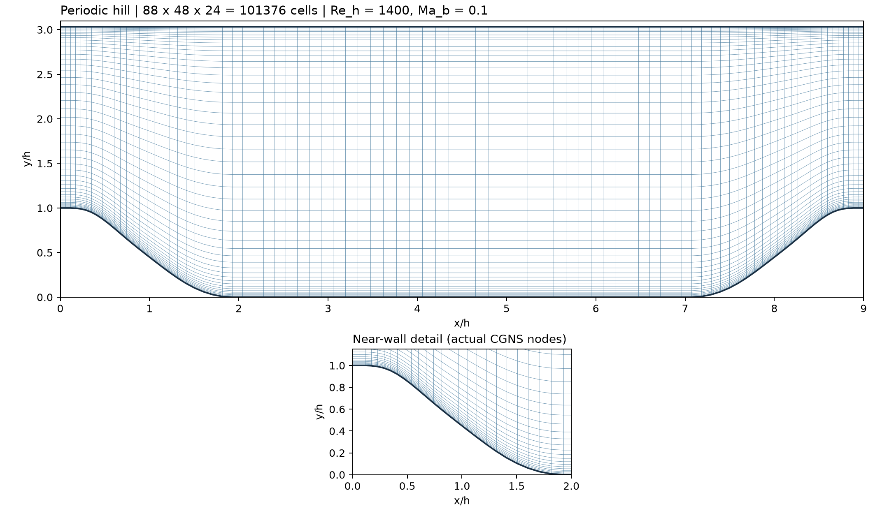

# 周期山 Re_h=1400 / Ma_b=0.1 / 无湍流模型 ILES

以用户提供论文第 5.3.4 节为依据，标准 9h×3.035h×4.5h 周期山，粗六面体网格 88×48×24=101376。论文只披露总单元数，没有披露各方向节点分配，本网格为近似重建。等温壁、网格加密、初场、控制律、统计窗口均为补充选择，详见源码包的 `docs/periodic-hill-v2.4.md`。



| 文件 | 用途 |
|---|---|
| `grids/hill_88x48x24.cgns` | 已生成 ADF-CGNS；单 zone，x/z 双向周期 |
| `smoke.wcns` | 相同粗网格，最多 3 步，t=0 开始统计，仅验收 |
| `production.wcns` | 服务器用；t_end=1000，预设 [100,1000] 统计窗口 |
| `production_restart.wcns` | 从 production 的 latest 检查点严格续算到 t=1000 |
| `mesh-inspection.txt` | 网格实际读取与连通检查记录 |
| `validation/` | 本机短步验收证据，不是收敛结果 |

以下命令都在本算例目录中执行。先将 `solver` 设置为已编译 `wcns_run` 的绝对路径：

```bash
solver=/absolute/path/to/WCNS_v2.4/build-mpi/wcns_run
mpiexec -n 4 "$solver" --config smoke.wcns --dry-run
mpiexec -n 4 "$solver" --config smoke.wcns
```

smoke 正常结束为 `reason=maximum_steps`，**退出码 2 是步数上限，需结合日志判断，不是数值失败**。每次试算需新输出目录，默认禁止覆盖。MPI 数目受自动分区最小尺寸约束；建议先 4 进程验收。

仅在目标服务器准备好后执行生产配置：

```bash
mpiexec -n 4 "$solver" --config production.wcns --dry-run
mpiexec -n 4 "$solver" --config production.wcns > production.log 2>&1
```

以上是人工启动命令，本机没有自动执行 production。输出目录相对**启动目录**，mesh.path 和 restart.path 相对**配置文件目录**。按上述方式在案例目录运行可保持一致。

生产默认每 10 个无量纲时间保存场和检查点，可根据服务器存储调整。长算可设置 `run.max_wall_time`；SIGINT/墙钟终止会按既有机制保存终场检查点。严格续算：

```bash
mpiexec -n 4 "$solver" --config production_restart.wcns
```

重启配置写到新的 `output/hill-production-resumed`；二次续算需更新 restart.path 和输出目录。`run.max_steps` 是累计步数。已到 t=1000 的检查点不会继续；若需延长统计窗口，strict 会拒绝定义变化，应预先规划完整窗口，或按 `algorithm_change` 开新统计段，不能把两段当作同一无缝平均。smoke 和 production 的统计起点不同，禁止直接严格续接。

关注 `_hill_history.csv` 的 Um、Uv、Re、force_next，`_hill_mean_xy.csv` 和 `_hill_profiles.csv` 的均值／协方差，`_hill_wall.csv` 的有符号 tau 和 Cf。统计窗口前均值文件只有表头。无湍流模式仍计算分子黏性；当前 ILES 耗散来自 WCNS 离散。短步有限性不证明长期稳定或网格分辨率充分。

重新生成相同网格（新文件名，生成器拒绝覆盖）：

```bash
/absolute/path/to/wcns_generate_periodic_hill_cgns regenerated.cgns 88 48 24
```

几何来源：[Almeida/TMR 分段多项式](https://tmbwg.github.io/turbmodels/Other_LES_Data/2Dhill_periodic/hill-geometry.dat)。论文 PDF 未复制到交付包。
