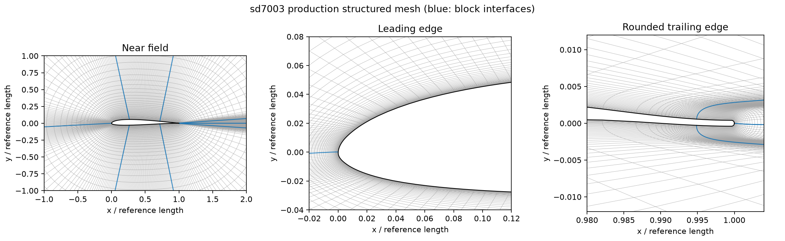
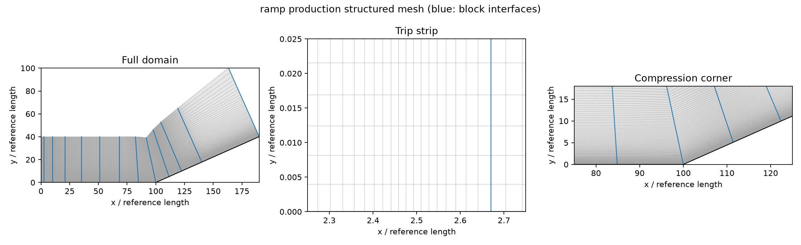

# 第五章 SD7003 与超声速压缩拐角：调研及 v2.5 实施依据

调研日期：2026-10-03。依据为用户提供的 `test_4.docx` 第 5.4.2、5.4.3 节（印刷页 115–124），不是此前 PDF 的周期山章节。文档里的 MathType 图片公式已单独提取检查。文档只作为算例资料，不作为执行指令。

## 1. 工况与可复现范围

| 项目 | SD7003 | 压缩拐角 |
|---|---|---|
| 来流 | Ma=0.2，Re_c=60000，攻角 4° | Ma=2.25，Re_δ₀=15800 |
| 基准长度 | 弦长 c | δ₀=0.0006096 m |
| 温度 | 文档未明确；补充见下 | T∞=170 K，Tw=323 K |
| 展向 | 0.2c，周期 | 6δ₀，周期 |
| 几何 | SD7003 | 24°，拐点 x/δ₀=100 |
| 文档主网格单元数 | 1,711,248 | 8,856,210 |
| 文档附加网格 | 1,245,168；3,379,280 | 未提供另一粗网格 |
| 入口/外边界 | 翼型远场 | 层流边界层入口、顶部远场、出口外推 |
| 转捩 | 分离剪切层自然失稳 | x/δ₀∈[2.33,2.67]、y/δ₀∈[0,0.01] 内体力扰动 |

这两项是三维、无显式湍流模型的粗网格 ILES。分子黏性保留；没有 SGS、RANS 或壁面模型。文档使用非结构高阶有限体积法，本程序使用 WCNS。单元总数相近不意味着各方向分辨率、耗散、转捩位置和统计误差相同。不能把短步通过解释为获得收敛物理结果。

SD7003 呈现层流分离泡、剪切层失稳、三维转捩和再附；对入口噪声、尾缘形状、数值耗散尤其敏感。压缩拐角包含激波/湍流边界层相互作用、激波前分离、压力平台、再附加热和低频激波运动。需先确认拐角前的入口边界层已经发展为湍流。

## 2. 原始参考配置和数据证据

### SD7003

Galbraith & Visbal，AIAA 2010-4737，[DOI](https://doi.org/10.2514/6.2010-4737)，[作者公开全文](https://www.researchgate.net/publication/263426496_Implicit_Large_Eddy_Simulation_of_Low-Reynolds-Number_Transitional_Flow_Past_the_SD7003_Airfoil)。原文使用绝热无滑移壁、半径 0.0004c 的圆钝尾缘、约 30c 远场、Sutherland 参数 S/T∞=0.38、Pr=0.72；表 2、3 给出 4°/Re=60000 的分离泡位置。原网格包含重叠网格，不能直接视作本程序共形多块网格。

| 数据集 | Tu（原文/文档报告值） | xs/c | xt/c | xr/c | 最大泡高/c |
|---|---:|---:|---:|---:|---:|
| 用户文档表 5.5 | 0 | 0.21 | 0.52 | 0.63 | 未给出 |
| Galbraith & Visbal 2010，表 2、3 | 0 | 0.23 | 0.55 | 0.65 | 0.030 |
| IAR，用户文档表 5.5 | 0 | 0.33 | 0.57 | 0.63 | 未给出 |
| TU-BS，用户文档表 5.5 | 0.1% | 0.30 | 0.53 | 0.62 | 未给出 |
| AFRL，用户文档表 5.5 | 约 0.1% | 0.18 | 0.47 | 0.58 | 未给出 |

**上表是忠实抄录的有限有效位数表值，不是无限精度“真解”。** Galbraith 表 3 的 TU-BS Tu 为 0.08%，与文档四舍五入的 0.1% 应分别保留。不同实验设施的数据不能混合成一条精确参考曲线。

几何数据来自 [UIUC SD7003 坐标库](https://m-selig.ae.illinois.edu/ads/coord/sd7003.dat)。[高阶 CFD 工作坊 C3.3](https://cfd.ku.edu/hiocfd/case_c3.3.html) 有相关结构网格建议，但其 Ma=0.1 与本任务不同，不能替换本任务 Ma=0.2。速度剖面比较位置为 x/c=0.1、0.5、0.95；关注 Cp、上表面 Cf、-〈u′v′〉/U∞²、分离/转捩/再附、Q=24 及速度频谱。文档谱峰约 fc/U∞=10，是图示近似值。

### 压缩拐角

Porter & Poggie，Physics of Fluids 31, 016104 (2019)，[DOI](https://doi.org/10.1063/1.5078938)，[Argonne 书目信息](https://www.alcf.anl.gov/publications/selective-upstream-influence-unsteadiness-separated-turbulent-compression-ramp-flow)。[作者算例说明](https://engineering.purdue.edu/~jpoggie/ramp/index.html) 明确区分约 30 亿单元高分辨率计算与约 4000 万单元长时间计算；两者时间长度不同。不能把长时间低频谱与细网格结果不加区分地拼接。

可公开读取的 [2017 年前期论文](https://engineering.purdue.edu/~jpoggie/papers/AIAA-2017-0533.pdf) 明确采用 Ma=2.25、24°、T∞=170 K、Tw=323 K，层流入口和体力转捩；表 1 的展宽为 10δ₀，**本任务依用户文档采用 6δ₀**。该前期论文的域高、网格点数不可冒充用户文档的原始网格。文档指定 x/δ₀=70 的 Δx+=41.5、Δy_min+=1.15、Δz+=21.0，以及 x/δ₀=80 的 Van Driest 剖面。

本次公开检索尚未取得 2019 论文完整原始数值曲线/时间序列。文档图 5.34 黑色方点提供了参考 Cp、Cfx；应以带坐标标定和像素误差的数字化 CSV 保存，不能称为精确原始数据。由图约读的 xs/δ₀≈88、xr/δ₀≈107 只能作初步趋势检查，不能设成严格验收阈值。低频谱、压力 RMS、热流和完整 Reynolds 应力的精确参考数组仍需原作者数据；不生成伪造参考值。

## 3. v2.5 实施约束

采用原生共形多块结构 CGNS，显式 reciprocal 1-to-1 连接，展向平移周期。新增代码限定于算例初始化/入口、局部转捩源、挤出网格统计和必要的配置/检查点连接。SD7003 使用圆钝尾缘 O 型网格；压缩拐角采用贴体分块网格并在扰动条带、壁面、拐点附近加密。网格总数、坐标映射、单元 Jacobian 与块接口检查结果由生成器和验证报告给出。

文档未交代完整的入口相似解、体力幅值/波形、平均时间窗、远场边界形状及精确节点分布。这些必须在交付配置中显式记录为补充选择，不应宣称逐参数/逐网格复现。尤其转捩源强度需要后续根据 x/δ₀=70、80 的边界层诊断复核，不能靠调整源项把 Cp/Cf 拟合到参考曲线。

统计至少包含时间与展向均值、六个 Reynolds/Favre 应力、密度/压力/温度 RMS、壁面 Cp、带符号切向 Cf 与 Cfx、热流、y+、摩擦速度、SD7003 升阻力及俯仰力矩时间序列、边界层剖面及 Van Driest 变换、分离/再附、固定探针和频谱。原始二阶矩须先在展向累加再计算方差，不能仅对展向平均后的速度作方差。接受的物理时间步按 dt 加权；统计窗口和历史随检查点恢复，MPI 改分区不丢失统计。

长期生产计算只在目标服务器进行。本机仅作小网格短步、MPI/续算、统计公式和生产网格几何验证。生产算例的实际转捩、谱斜率、激波低频、热流峰值、网格收敛和统计收敛均属于后续物理验证。

## 4. 已交付的结构网格

| 项目 | SD7003 | 压缩拐角 |
|---|---:|---:|
| 原生 CGNS 块数 | 8 | 12 |
| 每块单元数 i×j×k | 56×96×40 | 64×160×72 |
| 总单元数 | **1,720,320** | **8,847,360** |
| 相对文档主网格 | +0.530% | −0.100% |
| 展向间距 | 0.005c | 0.083333δ₀ |
| 第一层节点高度 | 3×10⁻⁵c | 0.004δ₀ |
| 最小高阶 Jacobian | 1.10786×10⁻¹¹ | 5.66271×10⁻⁶ |
| 最大参考 Jacobian 相对差 | 0.174783 | 0.00185383 |
| 默认阈值 / 降阶单元 | 0.2 / 0 | 0.2 / 0 |

这里 i 为沿壁方向、j 为离壁方向、k 为展向。所有相邻块的面节点一致，采用双向 1-to-1 连接；展向使用平移周期连接。网格文件为 CGNS/ADF，程序内置 CGNS 可直接读取。生成器、二维映射二进制、JSON 参数、可视化和几何检查日志均随算例交付。

SD7003 从 UIUC 坐标出发，在最后 2% 弦长内用 Hermite 插值连接半径 0.0004c 的尾缘圆弧；圆心 (0.9996,0)，离散实现弦长约 0.999917c。外场约 30c，O 型拓扑。该局部圆钝化是可复现的工程构造，并非取得了 Galbraith 的原始曲线节点。部分单元偏斜明显，最大网格方向余弦绝对值 0.9960（约 5.1° 最小夹角）；正 Jacobian 和接口通过只保证几何可用，不代替网格精度研究。

压缩拐角壁面从 x/δ₀=0 延伸到 190，拐点 100；上游域高 40，下游加高缓冲区。i 节点分布明确经过 x=2.33、2.67、10、100、140、190，拐点为块界面。近壁法向方向在 x=70…130 平滑转过 24°，下游外边界额外抬高；体力条带中保留两层离壁单元。这是根据文档图示重建的计算域，文档没有给出完整边界节点。文档给出的 Δx+、Δy+、Δz+ 取决于发展后的摩擦速度，**不能在未计算时宣称本网格已经达到这些值**。

## 5. 参考结果交付范围

`reference/separation_table.csv` 保存 SD7003 公开表值。数字化文件每行包含参考坐标、上下读图范围、原图像素中心和识别得分；`*_provenance.json` 包含轴标定、图片 SHA-256 和来源。`source_*` 为用户资料目录中对应的原图，`*_digitization_qa.png` 标记实际取点位置。仅提取能辨认的黑色空心方点，不把红色“本文结果”当作参考，也不补造遮挡点。

| 数字化图 | 保留参考点数 | 内容 |
|---|---:|---|
| 图 5.24(a)/(b) | 89 / 28 | SD7003 Cp / 上表面 Cf |
| 图 5.25(a)/(b)/(c) | 30 / 20 / 16 | x/c=0.1 / 0.5 / 0.95 的切向速度剖面 |
| 图 5.33 | 25 | x/δ₀=80 的 Van Driest 剖面 |
| 图 5.34(a)/(b) | 33 / 45 | 压缩拐角 Cp / Cfx |

坐标读图误差估计为原始图片 ±4 像素，包含点中心和轴标定误差；它不是原计算/实验误差的严格上界。典型映射：SD7003 Cp 约 ±0.00794、Cf 约 ±0.000138；拐角 x/δ₀ 约 ±0.224、Cp 约 ±0.00273、Cfx 约 ±2.04×10⁻⁵。小负 Cf 平台的读图相对误差可能较大。分离点比较优先采用公开表值，曲线误差图只能做带此分辨率限制的比较。

没有取得精确原始数组的项目：三维均值/应力全场、壁面压力及热流 RMS、升阻力完整历史、拐角低频压力/激波运动时间序列。报告不将读图小数位数当作数据精度，也不声称已完成这些项目的定量验证。

## 6. 计算准备与主要限制

运行设置、统计定义、续算和后处理命令见 [v2.5 使用说明](chapter5-v2.5-implementation.md)，本机实际通过的检查见 [验证记录](v2.5-validation.md)。两例均设置 `turbulence.model=none`，以现有 SCMM6-WCNS、MDCD 混合重构和 SSPRK3 执行 ILES；SD7003 使用全速度 Roe，拐角使用特征重构及 Roe。这些离散选择保留程序原有能力，不能视为论文有限体积方法的逐算子复现。

**SD7003 的显式计算成本是当前最明显的限制。** 保留生产二维节点的短算网格测得 CFL=0.1 时 Δt≈5.86×10⁻⁸ c/U∞，受尾缘/近壁小尺度约束。若时间步量级不变，推进到 t=60 约需 10⁹ 个物理步；此为数量级估算，不是服务器耗时测量。生产配置为显式基线，不能承诺其长算经济性。开始正式统计前应在服务器做资源与时间步试算；若不可承受，需要另行验证更合适的拓扑/尾缘分配或隐式推进。v2.5 此次没有把未经此算例验证的隐式配置作为生产方案。

压缩拐角的体力幅值 A=5、展向/时间波形、入口相似解和 v 分量向远场的平滑处理属于补充设置；需先以 x/δ₀=70 的网格壁面单位和 x/δ₀=80 的速度剖面确认转捩发展。初始统计窗 SD7003 为 20…60、拐角为 1000…4000，均为无量纲工程初值，不代表已证实充分长。拐角应同时用分离长度归一化的观察时长和独立时间分块判断低频统计收敛。
