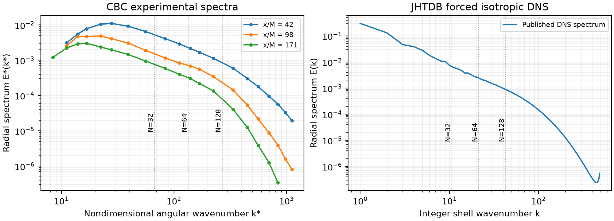

# 均匀各向同性湍流算例与 WCNS v2.6 实现报告

> 2026-10-07 增补：[两种初始化与预演化准备阶段](HIT初始化与预演化说明.md) 已实现；本报告以下正文保留 10 月 3 日的版本记录，涉及“尚未预演化”的描述仅适用于旧配置。

自由衰减湍流 强迫湍流 并行傅里叶初始化 粗网格 ILES

编制日期 2026年10月3日　程序版本 2.6.0　计算方式 三维可压缩黏性方程 无显式湍流模型

## 1 交付内容与验证结论

v2.6 在 v2.5 的多块结构网格求解框架内增加两类均匀各向同性湍流（HIT）算例：以 Comte-Bellot 与 Corrsin 实验为参照的自由衰减湍流，以及以 Johns Hopkins Turbulence Database（JHTDB）1024³ DNS 为参照的强迫湍流。两例均设置 turbulence.model=none，以数值格式的耗散承担未解析尺度的耗散作用。黏性项仍保留；无湍流模型不等于求解 Euler 方程。

交付包括并行初始化、三种低波数强迫、即时和时间平均统计、统计检查点、16³至128³的八块 CGNS 网格、完整配置、参考原始数据、比较脚本和服务器运行说明。已有槽道、周期山、SD7003 和压缩拐角的实现保留。

本机只执行解析单元测试、配置与网格检查、最多三步的16³短测，以及独立程序包的构建检查。已完成的检查验证了实现中的傅里叶归一化、初始无散条件、强迫约束、串并行一致性和续算一致性。它们不证明长期能谱、衰减率或高阶统计已经与实验或 DNS 一致。正式计算和网格、时间步、随机种子敏感性分析应在计算服务器完成。

## 2 两类 HIT 的研究背景与测试意义

自由衰减湍流没有持续能量输入。初始大尺度涡旋通过非线性相互作用将能量传向小尺度，再由黏性与离散耗散消除。总动能随时间变化及谱峰迁移，可以揭示 ILES 是否耗散过强、是否出现高波数能量堆积，以及粗网格是否保存了合理的大尺度演化。周期立方体排除了入口、出口和壁面模型的影响，但不能检验壁面阻力或分离再附着。

强迫湍流在低波数持续补充能量，适合研究统计平稳状态下的能量级联、惯性区、各向同性和间歇性。选择强迫方法本身就是算例定义的一部分。固定功率、固定总低波数能量、逐壳层固定能量通常会产生不同的大尺度时间相关性，不能仅因雷诺数相近便视作同一个参考算例。

这两例形成互补：自由衰减暴露初始谱和数值耗散的耦合；强迫湍流检验长期能量平衡和统计分布。建议先完成守恒与并行检查，再比较低波数谱、动能和总体各向同性，最后分析耗散、梯度高阶矩。对于粗网格，DNS 未滤波的最小尺度梯度并非可直接达到的目标。



## 3 自由衰减湍流的实验参考

### 3 1 实验与周期计算的对应

Comte-Bellot 与 Corrsin 的经典实验使用格栅产生近似各向同性湍流，并通过热线测量下游统计。本文选择其1971年论文中格栅间距 M=5.08 cm、平均风速 U₀=10 m/s 的数据，三个测站为 x/M=42、98、171。三维径向能谱见原文表3，均方根速度和耗散等见表4。[R1]

周期盒随平均流动平移，初始时刻对应42测站，后续时间采用 Taylor 对流换算 Δt=(x/M−42)M/U₀。周期长度取 Lref=11M=0.5588 m，参照 Stanford 公开初始场资料的盒长选择。[R2] 这是实验到计算域的理想化映射，不是在周期盒内重现风洞格栅或其上游发展段。

| 测站 x/M | 时间 Δt s | 单分量 u′ m/s | K m²/s² | ε m²/s³ |
|---|---|---|---|---|
| 42 | 0 | 0.222 | 0.073926 | 0.474 |
| 98 | 0.28448 | 0.128 | 0.024576 | 0.0633 |
| 171 | 0.65532 | 0.0895 | 0.012015375 | 0.0174 |

表中 K=3u′²/2 为采用各向同性假设换算的三分量总动能；原文给出的 Reλ 分别为71.6、65.3、60.7。原始测量与谱重建具有实验误差，上表应按论文有效数字解释，不能把双精度存储位数当成实验精度。表3有限波数范围的积分与表4的动能也不保证完全相等。

### 3 2 无量纲参数与文件

选择 Uref=√(3/2)×0.222=0.2718933614489327 m/s，使首测站完整参考动能 K*=1。密度尺度取1，运动黏度取 ν=1.5×10⁻⁵ m²/s，对应 Re=Uref Lref/ν=10128.9340。这里 Re 使用盒长和 Uref 定义，不是 Reλ。

| 参数 | 无量纲值 | 说明 |
|---|---|---|
| 周期域 | [0,1]³ | 三方向平移周期 |
| ν* | 1/10128.9340 | 常黏度 |
| 三个采样时间 | 0；0.138418438556；0.318856760245 | 由测站间距换算 |
| 三个完整参考 K* | 1；0.332440548657；0.162532464897 | 未作粗网格截断 |
| 三个完整参考 ε* | 13.17767909；1.75980398；0.483737587 | ε*=εLref/Uref³ |
| 参考 Mach 数 | 0.1 | 以 Uref 定义，非湍流 Mach 数 |

原谱的波数单位为 cm⁻¹，E 的单位为 cm³/s²。代码使用角波数约定，其转换是 k*=100k Lref，E*=10⁻⁶E/(Uref²Lref)，满足 K*=∫E*(k*)dk*。三个 original.csv 文件保留原表数值，三个 nondimensional.dat 文件直接用于计算或比较；CBC_exp.mat 保留作者公开资料中的原始数值载体。prepare_hit_reference.py 可从 CSV 重新生成无量纲文件，避免依赖 MATLAB。

本算例的 gas.specific_gas_constant=1 与 reference.temperature=5.2804285714 共同设置数值声速，使 Ma_ref=0.1。该温度是计算尺度参数，并非风洞真实空气温度。初始无量纲密度与温度均为1，平均速度为0；不应再叠加10 m/s的风洞对流速度。

### 3 3 初始谱与起始瞬态

程序从42测站谱生成具有随机相位的无散速度场，保留到整数波数半径 N/3。低于实验首个波数时以 k⁴ 延拓；超过实验末个波数时置零；数据范围内采用对数坐标插值。离散壳层的目标能量为 E(k_shell)Δk。

从参考文件读入的谱不再整体放大到 K*=1，因为这种放大会把未解析尺度的能量挪到粗网格大尺度上。16³仅用于冒烟测试，其截断很强；64³为首轮粗网格，32³与128³用于敏感性研究。初始能量随分辨率变化是有意保留的截断结果，应同时报告解析动能和参考全谱动能。

相位随机、谱匹配的场尚未具有真实湍流的三阶相关和成熟能量传递。均匀初始压力也不是针对该速度场求解的不可压压力平衡。因此自由衰减结果包含初始级联建立和声学调整。Stanford 资料采用演化后再匹配谱的准备过程；v2.6 本次交付实现的是直接谱初始化，未加入该预演化过程。[R2] 首轮比较应至少使用多个种子并单独展示起始瞬态；若需与成熟 CBC 初始条件严格对标，应后续增加受控预演化和谱重标定，不能把这部分偏差全部归因于 ILES。

## 4 强迫湍流的 DNS 参考

### 4 1 数据集与版本差异

JHTDB isotropic1024coarse 数据集来自1024³伪谱 DNS，周期盒为[0,2π]³，ν=0.000185，DNS 时间步为0.0002。公开资料提供能谱及动能、Reλ 的时间表，适合不下载完整三维数据库时进行统计比较。[R3–R5]

| 参考统计窗口 | K | ε | 单分量 u′ | Reλ |
|---|---|---|---|---|
| 旧版说明的扩展窗口 0至10.056 | 0.705 | 0.103 | 0.686 | 418 |
| 较短窗口 0至2.048 | 0.695 | 0.0928 | 0.681 | 433 |
| 本次保存的时间表 0至10.04 | 0.705309883 | 未提供 ε 列 | 不单独报告 | 见原始逐时列 |

第三行 K 是对公开 ASCII 时间表去除完全重复行后，以梯形积分计算的平均值，属于本次派生结果。原表共有507行数据、504个唯一时刻，重复时刻为2.04、3.06、5.06；表末为10.04。脚本保留原文件并明确记录去重过程。

官网与两个 README PDF 的帧数和终止时刻存在差别：网页及扩展说明采用5028帧、10.056；本次下载的 README-isotropic1024.pdf 使用5024帧、10.048，并列出短窗口统计。报告保留两份来源，不将它们混写为一个精确条件。spectrum.txt 的壳层能量和为0.7060484375，它与时间表均值的细小差别不应自动判为程序误差。参考统计的窗口与估计方法必须随比较结果一起标明。

这些值代表高分辨率 DNS 的统计参考，不是无限精度的真值。粗网格中 ε_viscous、梯度偏斜度和峰度对未解析高波数极为敏感，不能要求它们在不滤波的前提下与 DNS 全场数值完全一致。

### 4 2 与原 DNS 对应的强迫方法

Yu 等人的附录A给出了更精确的实现：每个完整时间步后，将两个低波数壳层的能量分别恢复至0.30与0.13。第一壳为0.5≤|m|≤1.5，第二壳为1.5<|m|≤2.5，其中 m 为整数波数向量。[R6] v2.6 的主配置采用 hit.forcing=jhtdb_shells。不能把这一设置简化成仅强迫 |m|≤2 的球形波数带。

程序先将速度投影为无散部分与纵向部分，仅缩放前者的两个壳层。每个已接受的 SSPRK3 完整步之后施加增量；同时修正守恒动量和总能量，使重标定前后的逐单元内能不变。默认扣除密度加权的平均加速度增量，以免产生净动量漂移。低 Mach 可压缩方程、时间积分和 WCNS 离散仍与不可压伪谱 DNS 不同，故此处为对齐强迫与物理尺度的粗网格近似。

两种附加方法供研究强迫敏感性：constant_power 对低波数无散加速度自适应缩放，使瞬时单位质量输入功率为0.103；constant_band_energy 根据当前半离散右端项选择系数，抵消整个球形强迫带的能量变化率。后者是阶段右端项约束，并非每步将两个壳层精确设定到0.30与0.13。只有 jhtdb_shells 是本次用于对照该 DNS 的主设置。

### 4 3 计算参数与统计窗口

| 配置项 | 主配置数值 | 使用方法 |
|---|---|---|
| 周期域与尺度 | [0,2π]³；Lref=Uref=1 | 波数间隔 Δk=1 |
| 黏度与 Reynolds 数 | ν=0.000185；Re=5405.405405 | 常黏度 |
| Ma_ref 与 Pr | 0.1；0.72 | 后续补做 Mach 敏感性 |
| 初始谱 | JHTDB spectrum.txt | 截断至 N/3，前两壳设为0.30与0.13 |
| 主强迫 | jhtdb_shells | 每个接受步作用一次 |
| 热量控制 | thermostat=true | 去除空间平均内能增长率 |
| 计划终止时间 | 80 | 服务器首轮预算 |
| 计划平均窗口 | 20至80 | 初始暂态排除时间须检查 |

持续输入动能最终转为内能，会使封闭可压缩盒温度缓慢上升。thermostat 从总能量右端项扣除空间平均内能增长率，以保持平均热状态接近固定值；它不直接松弛局部速度，也不是湍流模型。输出 cooling 供核查。此处理是本可压缩近似的附加设定，应在论文或报告中注明。

20至80的窗口是运行建议，尚未由长期测试验证。参考大涡周转时间约为2，因此计划窗口约覆盖30个周转时间；实际应检查分块动能均值、强迫功率、谱与各向同性是否稳定，并延长有显著漂移的窗口。不同随机初始相位不会复现 JHTDB 的逐时轨迹，比较应以均值、波动和谱为主。

## 5 并行傅里叶初始化与计算结构

### 5 1 离散约定与可复现性

正变换采用 û(m)=N⁻³Σu(x_j)exp(−2πim·j/N)，逆变换为未归一化求和。因此 Parseval 关系是 ⟨|u|²⟩=Σ|û|²，动能为非零模态的半平方和。零波数置零；随机数按规范化的整数波数向量和 hit.seed 生成，不依赖 MPI 秩、块编号或遍历顺序。共轭模态满足 Hermitian 对称，使逆变换为实数场。

投影使用 Pij=δij−mimj/|m|²，随后按 round(|m|) 分壳缩放。初始球形截断默认 N/3，且严格小于 Nyquist 半径 N/2。强迫主配置要求两个壳层完整包含于初始截断中。无参考谱文件时可使用 k⁴exp[−2(k/kpeak)²] 的解析谱，并归一化到 hit.initial_energy；有参考文件时 initial_energy 不参与归一化。

速度写入单元中心的求解自由度；此过程没有额外施加体积平均的 sinc 滤波。比较滤波 DNS 时必须与这种采样约定及实际网格分辨能力保持一致。初始 N/3 截断只是初始场带宽控制，并不意味着 WCNS 时间推进自动采用伪谱的全程去混叠规则。

### 5 2 MPI 与 FFTW 的分工

求解器继续按照 CGNS 多块拓扑分区。HIT 模块只建立本进程单元到全局规则盒索引的映射，再通过 MPI_Alltoallv 将数据重排到 slab 布局。三维 FFT 由局部一维变换和 slab 转置组成，最后将数据映回本地求解块。不在每个进程复制完整 N³ 速度场，也不以根进程完成全部 FFT。

默认后端是 FFTW 3.3.11 的双精度一维变换，MPI 分布和转置由 WCNS 实现。程序不调用 fftw_mpi_*，也不要求链接 libfftw3_mpi。设置 WCNS_ENABLE_FFTW=OFF 时使用内置 radix-2 一维 FFT，同时保留相同的 MPI 分布算法。FFTW 原始源码包和许可文件已纳入交付，构建不需要在线下载该库。[R7]

当前 HIT 只支持三方向相同的2次幂网格数 N，范围8至512，以及均匀、轴对齐、完整覆盖[0,L]³的周期立方体。构造时验证单元中心、体积和全局覆盖；错误网格不会静默退化为近似 FFT。后端支持不能整除 N 的进程数，3进程 FFT 测试已覆盖这种情况。建议进程数不大于 N，实际还受原求解器的最小局部单元数限制。

新增 FFT 和局部统计工作空间按 O(N³/P) 增长，另有壳层数组和 MPI 计数等小数组；这并非整个求解器内存的完整估算。谱统计需要多次逆变换求梯度，强迫也需集体通信，不能由本次微型测试推断大规模并行效率。

### 5 3 与现有程序的连接

initial.type=hit 将初始场交给 HitRuntime。ViscousWcnsSolver 新增阶段集体源项回调和已接受完整步变换回调；常规算例没有注册回调时沿用原路径。统计观察器在输出和检查点之前取得已接受状态，CBC 指定采样时刻同时作为时间事件，使推进准确落在三个测站时刻。

检查点保存 HIT 配置签名、参考谱内容散列、时间积分、上一采样状态、已接受步号及时间。strict 续算核对这些信息，允许改变进程数和分区；改变种子、谱内容、统计窗口或强迫参数会被拒绝。algorithm_change 是有意改变算法并重启统计的路径，不应用来掩盖意外配置不一致。

## 6 统计量定义与比较方法

### 6 1 全局统计

每个采样状态输出53个物理或诊断量，并附 step、time、epsilon_balance_residual、statistics_weight 和 statistics_intervals。均匀盒采用体积平均，Favre 量采用密度加权。下表给出完整分组，确切列名可直接读取 history.csv 表头。

| 分组 | 输出量 | 主要用途 |
|---|---|---|
| 平均和热力学 | ρ、u、v、w、p、T 的均值；ρ、p、T 的 RMS | 密度与压力波动、热状态、漂移 |
| 二阶矩 | uu、vv、ww、uv、uw、vw；Favre 均值及六个二阶矩 | 各向同性、可压缩效应 |
| 能量 | K、K_mass、urms、总能量、总质量 | 衰减、守恒和能量预算 |
| 梯度 | ε_viscous、enstrophy、divergence_rms、pressure_dilatation、helicity | 已解析耗散及无散程度 |
| 尺度 | L_integral、lambda_isotropic、Re_lambda_isotropic、eta、kmax_eta、Mt | 分辨率诊断 |
| 谱分解和强迫 | K_solenoidal、K_dilatational、K_forced_band、forcing_power、cooling、forcing_alpha | 强迫平衡与声学污染 |
| 高阶矩与恒等式 | 三个纵向速度梯度的偏斜度和峰度；parseval_error | 各向同性、间歇性、FFT 一致性 |

K=⟨u′ᵢu′ᵢ⟩/2，urms=√(2K/3)。K_mass=⟨ρuᵢuᵢ⟩/(2⟨ρ⟩) 包含平均速度的动能，用于整体预算；它不是去除 Favre 均值后的湍动能。总质量与总能量还乘以盒体积，因此强迫盒体积为(2π)³，不能将它们直接当体积均值。

梯度用当前速度场的谱导数计算；Nyquist 导数按实值配点约定置零。ε_viscous=⟨2μSᵈᵢⱼSᵈᵢⱼ⟩/⟨ρ⟩，Sᵈ 为去迹应变率；enstrophy=⟨|ω|²⟩/2，pressure_dilatation=⟨p∇·u⟩/⟨ρ⟩。这些是独立的诊断导数，并不是 WCNS 黏性离散算子逐项导出的耗散预算。

λ=√(15νurms²/ε_viscous)，Reλ=urmsλ/ν，η=(ν³/ε_viscous)^(1/4)，kmax_eta=(Nπ/L)η。上述公式依赖各向同性假设；粗网格缺失梯度能量时，这些值与 DNS 的完整尺度不同。Mt=√(2K)Ma_ref/√⟨T⟩，与输入的 Ma_ref 有区别。L_integral 使用离散模态的 E/|k| 求和，系数为3π/(4K)。

### 6 2 能谱与空间相关

spectrum.csv 输出每个时刻的三维径向 E、无散谱、纵向谱和各速度分量半能量谱，壳层定义为 round(|m|)，k=sΔk，E=壳层动能/Δk。零模态不计入脉动能。高于 N/2 的壳层只包含立方网格角落的部分方向，比较时应单独标记，不作为完整球壳的高精度各向同性谱。

spectrum_1d.csv 给出沿 x 的单边 F11、F22、F33，其正负 kx 合并，满足 ΣFiiΔk=⟨u′ᵢ²⟩。这里没有额外的1/2，因此不能与三维径向 E 直接重叠。correlation.csv 给出沿 x 分离的未归一化 R11、R22、R33 和 Dii(r)=2[⟨u′ᵢ²⟩−Rii(r)]，分离距离从0至L/2。它们是二阶结构函数，不包含三阶4/5定律统计或全方向平均。

means.csv 对全局标量采用梯形时间积分，并对统计窗口边缘作线性插值；spectrum_mean.csv 使用右端点加权。statistics_weight 记录实际累计时长，不能用输出文件行数代替独立样本数。衰减流应比较指定时刻的瞬时空间集合统计，不应将整个衰减时段平均后与单个实验测站比较。

### 6 3 数值耗散与误差解释

程序用相邻采样的质量加权动能差，以及采样端点的强迫功率、压力膨胀功和黏性耗散，估计 epsilon_balance_residual。这个余项同时含空间离散、时间离散、梯度诊断差异和时间采样误差。jhtdb_shells 的 forcing_power 是最近接受步的重标定功率，稀疏统计并未对所有步的输入功进行精确累加。因此该余项只能用于预算诊断，不能直接称为严格的 SGS 耗散率，也不保证每个采样区间为正。

analyze_hit.py 将 CBC 输出与指定测站匹配，生成动能和逐壳谱比较表；未达到测站时明确标记 not_reached。强迫流脚本报告公开时间表均值、均值差、谱差和五段动能均值，并检查累计时长。默认最短时长20仅是初筛条件，不能代替平稳性及分块独立性检查。续算后的累计均值包含之前检查点的统计，但当前目录的时间历史可能只包含新段；用重复的 --history 参数补入旧段后再估计分块误差。

建议正式报告同时给出低波数谱误差、截断范围、总动能及分量比、输入和耗散趋势，并用至少3个随机种子考察有限盒采样差异。比较无显式模型的不同格式时应固定网格、初始种子、物理黏度和强迫方法。不要通过改黏度把已解析 Reλ 强行调到 DNS 值后仍声称保持相同物理算例。

## 7 网格与详细运行配置

### 7 1 多块网格

| 文件 | 总单元数 | 块划分 | 用途 |
|---|---|---|---|
| hit16.cgns | 4096 | 2×2×2 | 本机三步冒烟测试 |
| hit32.cgns | 32768 | 2×2×2 | 更粗一级的服务器对照 |
| hit64.cgns | 262144 | 2×2×2 | 首轮主配置 |
| hit128.cgns | 2097152 | 2×2×2 | 网格敏感性 |

每块为均匀笛卡尔结构网格，块间使用 CGNS 一对一连接；盒外表面使用带平移的周期连接。两例分别使用 L=1和L=2π的坐标，不能互换网格而只改配置盒长。生成器命令为 wcns_generate_hit_cgns 文件名 N 每方向块数 L；它拒绝覆盖已有文件。

### 7 2 空间时间离散

交付配置使用 scmm6_wcns、mdcd_hybrid 特征变量重构，色散系数0.0463783、耗散系数0.001，Roe all-speed 通量的 reference_mach=0.1、dissipation_scale=0.02、pressure_coefficient=0.05。时间积分为 SSPRK3，CFL=0.2，无预条件、无显式湍流模型。黏性输运取常黏度，Pr=0.72。robustness.enabled=false，用于明确暴露失稳；这些参数是从现有程序延续的首轮研究配置，尚未经 HIT 长计算优化。

除 hit.type 外的 HIT 专用参数如下。完整参数组合保存在各 .wcns 文件中，不依赖命令行隐含覆盖。

| 参数 | 含义 | 交付设置或约束 |
|---|---|---|
| hit.n 与 hit.length | 全局每向单元数及盒长 | 与网格严格一致 |
| hit.seed | 随机相位种子 | 20261003 |
| hit.spectrum_file | 两列 k 与 E 的谱文件 | 相对配置目录解析 |
| hit.cutoff | 初始整数波数截断 | 0表示N/3；必须小于N/2 |
| hit.initial_energy 与 hit.peak_wave | 解析初始谱参数 | 仅无外部谱时使用 |
| hit.forcing | 强迫算法 | 自由衰减忽略；强迫主例用jhtdb_shells |
| hit.forcing_power | 恒定功率目标 | 0.103；只控制constant_power |
| hit.forcing_kmax | 球形强迫带上界 | 2；不控制jhtdb_shells的双壳定义 |
| hit.remove_mean_acceleration | 去除质量加权平均加速度 | true |
| hit.thermostat | 平均内能增长率修正 | 衰减false；强迫true |
| hit.statistics.start 与 end | 时间平均窗口 | 衰减全程；强迫20至80 |
| hit.sample_every_steps | 谱与全局统计间隔 | 正式10步；冒烟每步 |
| hit.write_every_samples | 均值文件刷新间隔 | 正式100次；结束时也写出 |
| hit.sample_times | 精确时间事件 | 衰减三个测站 |

HIT 模块是 initial.type=hit 的独立源项路径；source.enabled=false 关闭的是原通用体力模块，不会关闭 hit.type=forced 的强迫。output.statistics 控制的通用守恒量文件与 HIT 专用统计文件同时存在。hit.sample_every_steps 控制专用文件，不能用通用 output.statistics.every_steps 代替它。

### 7 3 文件选择与服务器操作

smoke.wcns 限制为16³、3步、120秒，用于安装检查。coarse32.wcns、production.wcns、refine128.wcns 分别对应32³、64³、128³。强迫算例另附 constant_power.wcns。production_restart.wcns 是带 REPLACE_WITH_CHECKPOINT 占位符的续算模板，必须先替换实际检查点路径；也可使用 prepare_hit_restart.py 自动创建保持原谱路径标识的续算配置。

在 Linux 服务器解压程序源码与两个算例包后，安装具有 C++17 支持的编译器、CMake及 MPI 开发环境。FFTW 与 CGNS 源码已包含，推荐从独立源码目录构建 MPI 版本。下面命令中的 CASE 替换为相应算例包目录，P 为进程数。网格和谱路径相对配置文件解析；相对 output.directory 则相对程序启动目录解析，因此应先进入算例目录再运行。

```sh
cmake -S WCNS_v2.6 -B build-v26 -DCMAKE_BUILD_TYPE=Release \
  -DWCNS_ENABLE_MPI=ON -DWCNS_ENABLE_FFTW=ON
cmake --build build-v26 -j --target wcns_run wcns_generate_hit_cgns
BIN="$(pwd)/build-v26/wcns_run"
cd CASE
mpiexec -n 4 "$BIN" --config smoke.wcns
mpiexec -n P "$BIN" --config production.wcns --dry-run
mpiexec -n P "$BIN" --config production.wcns
```

冒烟测试正常达到 max_steps 时返回码为2；需要结合日志停止原因判断，不能只用非零返回码认定失败。正式配置 max_wall_time=82800 秒是服务器每段预算，不是本机执行请求，也不是预计收敛时间。输出默认拒绝复用已有目录。先使用 --dry-run 检查 MPI 分区与几何，再启动正式计算。

```sh
python tools/prepare_hit_restart.py production.wcns \
  output/旧段/实际.checkpoint.cgns --name resume.wcns \
  --output output/新段
mpiexec -n P "$BIN" --config resume.wcns
python tools/analyze_hit.py --case forced --reference reference \
  --output output/新段 --result comparison \
  --history output/旧段/实际_hit_history.csv
```

配置和数据目录整体移动没有问题；为了保持 strict 的谱标识，不应在连续运行中随意把谱路径从相对写法改为绝对写法。prepare_hit_restart.py 将新配置放在原配置同一目录，保留网格和谱的路径表示。CBC 比较把 --case forced 改为 --case decay。

## 8 本次测试证据与适用边界

解析测试使用包含一倍和二倍波数的三分量速度场，验证 K=0.9375、各法向二阶矩0.625、enstrophy=1.5、ν=0.001时ε=0.003、散度为0。还检查恒定功率、重标定后前两壳总能量0.43、逐点内能保持及检查点状态恢复。

FFT 测试在1、3、4进程上检查逆变换、Parseval 与零模态；FFTW 和内置后端均通过。相关 CTest 共7项通过，包括已有基础、周期山和第五章算例回归。16³短测比较串行、MPI 4进程、同分区续算和跨2进程续算的最终全场及各类统计；已完成的八块测试最大归一化差约7.2×10⁻¹³，同进程续算差为0。浮点归约顺序不同可能带来末位差异，不承诺任意平台位级一致。

测试还覆盖错误网格尺寸、strict 续算种子不符、强迫初始截断不足等拒绝路径，以及单个原始块被 MPI 自动切分后的 FFT 映射。64³两例完成 MPI 4进程的严格几何和配置 dry-run。具体检查结果保存在 validation 日志及 runtime-evidence.json，独立程序包检查记录保存在 package-validation.txt。

本次没有执行从 CBC 第一测站到第三测站的完整衰减，也没有执行强迫流至统计平稳。128³网格已生成，未进行生产时间推进。当前没有在线输出梯度 PDF、三阶结构函数、瞬时谱通量或精确离散逐项能量预算；需要这些研究指标时可从保存场离线计算或扩展模块。现有统计足以开展本次两类粗网格 ILES 的基础对比，但不能替代所有湍流理论诊断。

建议服务器验证依次完成64³主例、32³与128³对照、时间步减半、多个种子和更低 Mach 数检查。确认数值误差、可压缩近似及统计不确定度后，再据此判断 ILES 格式的优劣。

## 9 来源与参考文献

R1　Comte-Bellot, G. and Corrsin, S. 1971. Simple Eulerian time correlation of full- and narrow-band velocity signals in grid-generated isotropic turbulence. Journal of Fluid Mechanics 48(2), 273–337. DOI [10.1017/S0022112071001599](https://doi.org/10.1017/S0022112071001599)。本报告使用表3与表4的公开数值；[论文公开副本](https://courses.washington.edu/mengr544/handouts/comtebellot-corrsin-jfm-71.pdf)。

R2　Bae, H. J. Initial conditions for large-eddy simulation of decaying homogeneous isotropic turbulence. [Stanford 作者资料页](https://web.stanford.edu/~hjbae/CBC)，[ic_gen 原始资料包](https://web.stanford.edu/~hjbae/ic_gen.tar)。本次保存其中 CBC_exp.mat，并保留原始表格单位。

R3　Johns Hopkins Turbulence Database. [Homogeneous isotropic turbulence 数据集入口](https://turbulence.idies.jhu.edu/datasets/homogeneousTurbulence/isotropic)。读取日期2026年10月3日；版本差异见正文。

R4　JHTDB. [公开三维能谱](https://turbulence.idies.jhu.edu/docs/isotropic/spectrum.txt)；[动能和 Reλ 时间表](https://turbulence.idies.jhu.edu/docs/isotropic/ener_Re_time.txt)。本次随包保存原始文件与 SHA256，派生比较不改变原文件。

R5　JHTDB. [README-isotropic 扩展说明](https://turbulence.idies.jhu.edu/docs/isotropic/README-isotropic.pdf)；[README-isotropic1024 说明](https://turbulence.idies.jhu.edu/docs/isotropic/README-isotropic1024.pdf)。两份文件均随强迫算例包保存。

R6　Yu, H. et al. 2012. Studying Lagrangian dynamics of turbulence using on-demand fluid particle tracking in a public turbulence database. Journal of Turbulence 13, N12. [作者预印本及附录A](https://turbulence.pha.jhu.edu/papers/getposition-yuetal2012-preprint.pdf)。用作双壳层强迫定义的一手来源。

R7　FFTW. [官方下载页](https://fftw.org/download.html)及[官方 MPI 使用说明](https://fftw.org/fftw3_doc/Linking-and-Initializing-MPI-FFTW.html)。本程序采用3.3.11本地一维 FFT 与自有 MPI 转置层；不宣称调用原生 FFTW MPI 接口。

R8　Rogallo, R. S. 1981. Numerical experiments in homogeneous turbulence. NASA Technical Memorandum 81315. [NASA 文献入口](https://ntrs.nasa.gov/citations/19810022965)。均匀湍流傅里叶初始化的经典背景；本次实现细节以第5章及源码为准。
