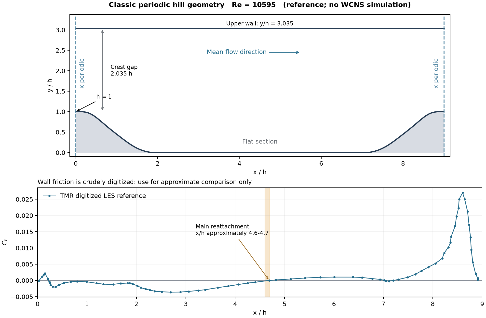

# 周期山流动算例调研与 WCNS v2.3 计算适用性评估

调研日期：2026年10月2日。对象：当前 WCNS v2.3 发布源码。范围：文献与数据调研、源码能力核查、后续计算方案评估。

**结论：周期山流动适合作为 WCNS v2.3 从平槽道推进到曲壁分离流的验证算例。程序具有结构周期连接、黏性流、SST-RANS 和三维 LES 的基础能力，但现阶段不能直接认定为已具备标准周期山算例的完整验证流程。** 正式计算前，应先确定同一套几何和参考数据，落实山顶截面流量控制或标定、驱动做功的热平衡，以及曲壁摩擦和局部湍流统计。

建议后续优先考虑经典 $Re_h=10595$ 工况，先用二维 SST-RANS 检查工程流程，再评估三维壁面解析 LES。该顺序是本报告的建议，尚未作为计算任务执行。按照本轮确认的范围，**未生成网格、求解器配置或计算算例，未编译、运行求解器或修改程序源码**。图中的摩擦曲线来自公开参考数据，不是 WCNS 计算结果。

## 1 算例价值与基准选择

周期山是在平直上壁与周期起伏下壁之间的内流。流动经过山顶后分离，在背风侧形成回流区，随后在谷底再附并向下一座山加速。其价值在于同时考察曲壁压力梯度、分离剪切层、再附和湍流非平衡效应；周期条件也避免了另行指定复杂湍流入口。几何及统计平均可以是二维的，但瞬时湍流仍为三维；二维非定常计算不能作为三维 LES 的替代。[ERCOFTAC 算例说明](https://kbwiki.ercoftac.org/w/index.php?title=Abstr:2D_Periodic_Hill_Flow)

| 候选基准 | Reynolds 数 | 主要参考 | 本项目用途判断 |
|---|---:|---|---|
| 经典周期山 | 10595 | TMR 汇集的 Temmerman 等 LES，Fröhlich 等文献 | 建议首选，便于从平均速度和壁面分离特征入手 |
| 参数化周期山原始几何 | 5600 | Xiao 等 DNS，TMR 29 组参数化数据库 | 适合后续模型误差分析及山形变化研究 |
| 可压缩周期山 DNS | 2800 | Balakumar 数据，$Ma=0.2$ | 可作为另一个独立验证工况，不与 10595 工况混用 |
| 更高 Reynolds 数周期山 | 19000 或 37000 | 后续实验与 LES 研究 | 本轮不建议作为首个生产目标 |

经典 LES 的几何与参考数据见 [TMR LES 页面](https://tmbwg.github.io/turbmodels/Other_LES_Data/2dhill_periodic.html)；参数化 DNS 见 [TMR 参数化周期山页面](https://tmbwg.github.io/turbmodels/Other_DNS_Data/parameterized_periodic_hills.html)；$Re=2800$、$Ma=0.2$ 的独立工况见 [TMR 可压缩 DNS 页面](https://tmbwg.github.io/turbmodels/Other_DNS_Data/2dhill_periodic_compress.html)。

Breuer 等在 2009 年以独立数值方法和实验交叉比较周期山流动，为该算例的物理可信度提供了依据。其结果覆盖多个 Reynolds 数，所以引用时仍须注明具体工况和数据版本，不能把不同文献的一条再附位置当成全部周期山计算的统一答案。[Breuer 等原始论文信息与摘要](https://portal.fis.tum.de/en/publications/flow-over-periodic-hills-numerical-and-experimental-study-in-a-wi/)

## 2 几何和物理量必须统一

### 2.1 经典工况的尺寸与边界

以下采用 TMR 经典 LES 页面标注的几何，记 $h$ 为山高，$H$ 为谷底到上壁的高度。所有长度均以 $h$ 无量纲化。

| 项目 | 经典 LES 页面给出的定义或本报告推导 |
|---|---|
| 山高 | $h=1$，原始几何文件对应 28 mm |
| 山顶间距 | $L_x/h=9$ |
| 上壁位置 | $H/h=3.035$ |
| 山顶净通道高度 | $(H-h)/h=2.035$，由上述尺寸相减 |
| 三维展向长度 | $L_z/h=4.5$ |
| 流向边界 | 两个山顶截面周期连接 |
| 展向边界 | 三维 LES 采用周期连接；二维 RANS 无展向求解 |
| 固壁 | 上下壁均无滑移；可压缩计算的热边界另行选定 |

经典 LES 页面给出的主分离位置约为 $x_s/h=0.2$，主再附位置约为 $x_r/h=4.6\text{–}4.7$。这些是该参考系列的近似定位；壁面上还可能存在其他小回流区，自动搜索时必须识别主回流泡。[经典 LES 定义及参考位置](https://tmbwg.github.io/turbmodels/Other_LES_Data/2dhill_periodic.html)

**3.035 与 3.036 应作为数据版本差异保留。** TMR 参数化 DNS 的基准高度是 3.036，而经典 LES 页面写作 3.035。二者仅相差 $0.001h$，但不能在网格、目标流量和参考剖面中交叉使用。后续生成网格之前，应再用选定数据库的原始网格确认实际高度；本报告的图示和推导明确使用 3.035。[参数化 DNS 几何定义](https://tmbwg.github.io/turbmodels/Other_DNS_Data/parameterized_periodic_hills.html)

图 1 上图按原始多项式绘制，箭头仅表示平均流向，没有绘制任何计算流线。下图为 TMR 发布的 77 个粗略数字化摩擦系数点。原文件明确提示仅供近似比较；曲线上出现的 $x/h=4.69$ 不能解释为精确到小数点后两位的再附基准。[山形原文件](references/hill-geometry.dat) · [摩擦系数原文件](references/hill_LES_cf_digitized.dat)

### 2.2 山形公式的使用方式

原始山形不是正弦曲线。TMR 提供六段三次多项式，原始横坐标区间为 0、9、14、20、30、40、54，山高为 28。第一段采用高度上限裁剪，末段采用非负裁剪。原文件已原样保存，后续应据此实现几何，而非凭示意图拟合。[TMR 原始山形](https://tmbwg.github.io/turbmodels/Other_LES_Data/2Dhill_periodic/hill-geometry.dat)

令 $\xi=x/h$，$s=28\min(\xi,9-\xi)$，$P(s)$ 表示原文件中的分段多项式。经典对称山形可表示为

$$
\frac{y_w(x)}{h}=\begin{cases}
P(s)/28,&0\le s\le54,\\
0,&s>54.
\end{cases}
$$

这里的 28 是原始坐标向山高归一化的换算因子。若多项式自变量改成 $x/h$，系数必须同时变换；只把区间端点除以 28 会得到错误山形。原文件末段二次项前省略了连接用的加号，数值系数为正；图示按该正系数绘制。

上述几何给出单侧山坡水平长度 $54/28=1.928571h$、谷底平段长度约 $5.142857h$。建模时还应检查多项式接点、山顶周期拼接、壁面法向以及离散度量一致性；这些属于未来网格检查，本轮没有生成网格。

### 2.3 Reynolds 数采用山顶截面体积流速

参考 Reynolds 数定义为

$$
Re_h=\frac{U_bh}{\nu},\qquad
U_b=\frac{1}{A_c}\int_{A_c}u\,\mathrm dA,\qquad
A_c=(H-h)L_z.
$$

因此三维不可压缩目标体积流量是 $Q_0=U_b(H-h)L_z$，二维单位展宽流量是 $q_0=U_b(H-h)$。对于 $H/h=3.035$，后者无量纲值为 2.035。**这里的 $U_b$ 不是全域体积平均速度，也不是谷底截面的面积平均速度。**

本报告按公开山形做 3001 点梯形积分，得到单位展宽流体面积约 $25.40412h^2$。若密度恒定且统计定常，由连续性可得

$$
\frac{\langle u\rangle_V}{U_b}
=\frac{L_x(H-h)}{\int_0^{L_x}[H-y_w(x)]\,\mathrm dx}
\approx0.72095.
$$

这一数值是几何积分和连续性推导，不是流场求解结果。把体积平均速度控制为 1 会显著偏离“山顶 $U_b=1$”的目标。可压缩程序还须区分质量流量 $\dot m=\int\rho u\,\mathrm dA$ 与体积流量：低 Mach 下二者可能接近，但应同时记录实际密度、山顶速度和实际 Reynolds 数。

## 3 参考数据及比较方法

### 3.1 本轮取得的数据与证据边界

| 资料 | 本轮状态 | 后续用途 |
|---|---|---|
| TMR 经典 LES 网页 | 已阅读 | 冻结 Reynolds 数、尺寸、数据来源和大致分离位置 |
| `hill-geometry.dat` | 已保存原文件和 SHA-256 | 山形定义 |
| `README_gridpoints_hill.txt` | 已保存 | 解释二维网格节点数据格式 |
| `README_p_vel_and_turb_hill.txt` | 已保存 | 解释中心场变量、排列和归一化 |
| `hill_LES_cf_digitized.dat` | 已保存并绘图 | 粗略壁面摩擦与主回流区定位 |
| `hill_grid.dat.zip` 与 `hill_LES_avgresults.dat.zip` | 已定位官方链接，未下载和检查完整内容 | 后续速度、压力与二阶矩的定量对比 |
| 参数化 DNS 29 组数据库 | 已阅读说明，未下载 1.2 GB 数据包 | 后续独立的 $Re=5600$ 研究 |

原始小文件、URL、访问日期、字节数和 SHA-256 记录在 [sources.json](references/sources.json)。本轮没有声称已完成完整 LES 数据解包、剖面插值或交叉数据集一致性检验。

TMR 的平均场说明采用 Tecplot BLOCK 排列；其示例中心场为 $196\times128$，对应节点示例为 $197\times129$。读取时须按实际文件的每个 zone 头部确定尺寸，不能把示例尺寸硬编码为通用规则。速度按 $U_b$ 归一化，二阶矩按 $U_b^2$ 归一化；`xnu_t` 是 SGS 黏度与参考分子黏度的比值，不能直接当作 RANS 的湍黏度验证答案。[网格说明](https://tmbwg.github.io/turbmodels/Other_LES_Data/2Dhill_periodic/README_gridpoints_hill.txt) · [平均场说明](https://tmbwg.github.io/turbmodels/Other_LES_Data/2Dhill_periodic/README_p_vel_and_turb_hill.txt)

### 3.2 推荐比较量

建议后续至少比较以下项目。剖面站位是本项目的建议输出集合，实际应在参考网格上采用一致插值方法。

| 项目 | 定义或推荐范围 | 用途 |
|---|---|---|
| 流量与实际 $Re_h$ | 山顶截面，另选谷底截面复核守恒 | 确认比较的是同一工况 |
| 平均速度 | $\bar u/U_b,\bar v/U_b$，建议 $x/h=0.05,0.5,1,2,3,4,5,6,7,8$ | 检查剪切层、回流及恢复段 |
| 二阶统计 | $\overline{u'u'},\overline{v'v'},\overline{w'w'},\overline{u'v'}$，均除以 $U_b^2$ | 判断 LES 的湍流结构和 RANS 闭合误差 |
| 下壁摩擦 | 有符号的局部切向 $C_f$ | 确定主分离与再附 |
| 压力变化 | 明确参考压力后的 $C_p$ 或沿壁压差 | 检查压力恢复和压力阻力 |
| 整体平衡 | 流量、总质量、驱动力与壁面载荷、输入功与排热 | 发现驱动、热边界及离散误差 |

应先分别确认参考压力的归一化和零点，再比较 $C_p$。周期驱动常采用周期压力加单独体积力；不能把周期压力本身的端点差当成施加的平均压力降。

对于 LES，应按相同约定区分解析尺度二阶矩与 SGS 应力；对于 RANS，二阶矩来自模型闭合，不能用定常解的时间方差代替。SST 与 LES 的差异同时包含模型误差和离散误差，应通过网格与时间步研究加以区分。

## 4 当前 v2.3 的核查结果

### 4.1 版本身份与已有验证程度

本轮以独立发布目录 `D:/program/WCNS_v3/WCNS_v2.3` 为审核对象，其 `WCNS_SOURCE_REVISION` 为

`977be30a12b7d066523d7804e2398d2c717ec181`。

当前 `wcns` 开发仓库 HEAD 也是该提交。本轮逐条计算发布清单中的 SHA-256，**160 个文件全部匹配**。报告及参考文件保存在开发仓库文档目录，没有修改发布包。

发布验收记录记载串行 113/113、MPI 230/230 自动测试通过；这些是 2026年9月29日已有记录，本轮未重新执行。发布说明明确未完成大型服务器、长期湍流统计等物理验收，不能由版本号或单元测试推断周期山精度已经验证。[v2.3 验收记录](../../../../WCNS_v2.3/docs/v2.3-validation.md) · [已知限制](../../../../WCNS_v2.3/docs/known-limitations.md)

### 4.2 能力与适用条件

| 所需能力 | v2.3 核查结果 | 对周期山的含义 |
|---|---|---|
| 结构曲线网格 | 支持二维及三维结构 CGNS；随包使用 ADF 后端 | 后续需生成共形结构网格，不能直接使用非结构或 HDF5-only CGNS |
| 周期连接 | 读取 `GridConnectivity1to1` 及周期变换 | 周期性应写入网格拓扑，不能仅依靠物理边界字符串 |
| RANS | SA-neg、modified SST-2003m；标准 k-epsilon 为实验支持 | 推荐以 SST 的 resolved wall 路径作为候选基线 |
| LES | WALE、动态及其他 Smagorinsky／相似类模型 | 有模型实现基础，尚需本算例物理验证 |
| 隐式推进 | 定常 LU-SGS，非定常 BDF2 双时间；无历史首步 BDF1 | RANS 与 LES 均可设计相应推进方案 |
| 低 Mach 路径 | Roe 加 Weiss–Smith 伪时间预处理；另有 Li–Gu 与 Rieper all-speed 通量 | 三者不是同一算法，需独立评估 |
| 驱动 | 固定体力及固定单位体积力 | 没有内置恒流量闭环，实际 $Re_h$ 需控制或标定 |
| 曲壁输出 | 通用边界压力、黏性牵引、$C_p/C_f$、壁面单位等 | 可用于曲壁后处理，但须检查局部切向和符号 |
| 槽道专用统计 | 三维、平面 x-z、等温 J 壁等限制 | 不适用于整个起伏下壁 |
| 时间统计 | 对已注册整体或截面量做接受步加权 mean、RMS、协方差 | 不等于保存每个 $(x,y)$ 的局部湍流二阶矩 |
| 重启 | `strict` 与 `algorithm_change` | 修改驱动等签名项时需要按变更模式处理 |

能力依据为 [完整配置模板](../../../../WCNS_v2.3/examples/full_case_template_v2.3.wcns)、[schema 2 参考](../../../../WCNS_v2.3/docs/config-reference-2.md)、[用户手册](../../../../WCNS_v2.3/docs/user-manual.md) 及下节列出的源码。LES 的已文档化组合是三维黏性非定常、LU-SGS/BDF2、`preconditioner.type=none`；不应直接把槽道 SSPRK3 配置复制为显式 SGS 的 LES。RANS、LES 和 LU-SGS 路径也不能依赖仅适用于显式路径的重试保护。

### 4.3 固定驱动力不能保证目标流量

源码中 `body_force` 添加的动量源是 $\rho\boldsymbol a$，能量源是 $\rho\boldsymbol u\cdot\boldsymbol a$。`pressure_gradient` 添加的动量源是 $\boldsymbol G$，能量源是 $\boldsymbol u\cdot\boldsymbol G$；头文件明确定义 $\boldsymbol G=-\nabla p$。因此正向驱动应使用正的 $G_x$，不能直接把负的 $\partial p/\partial x$ 原值填入。[源项实现](../../../../WCNS_v2.3/src/physics/source_terms.cpp) · [源项定义](../../../../WCNS_v2.3/include/wcns/physics/source_terms.hpp)

这两个配置均为固定参数，已知限制文档也明确说明没有恒流量闭环。`initial.bulk_velocity` 只是特定初场参数，不是运行时流量控制器。

后续有两条可行路线：

1. **保持 v2.3 求解器不变，标定固定驱动力。** 更适合先做 RANS。对若干固定 $G_x$ 求得稳定解，依据山顶实际流量修正驱动；最终冻结驱动，再独立收敛或统计。能实现目标平均流量的近似匹配，但不等同于逐时间步恒流量基准。
2. **实现并验证恒流量反馈。** 更适合要求严格复现驱动协议的 LES。需定义控制量、全局归约、更新频率、限幅、能量源一致性和重启状态；这属于未来程序变更，不是当前 v2.3 已有能力。

源项参数进入 restart signature。改变驱动力后，不能假定 `strict` 重启仍合法；`algorithm_change` 会重置相关历史和统计，故不能拼接调参阶段与正式统计阶段。[签名实现](../../../../WCNS_v2.3/src/runtime/case_config.cpp) · [重启规则](../../../../WCNS_v2.3/docs/config-reference-2.md)

山壁还贡献压力阻力，因此不能套用平槽道“体积力只平衡上下壁摩擦”的关系来估计最终驱动力。统计定常时，应检查整个流体体积内的驱动力与上下壁压力、黏性载荷的合力平衡，并统一法向及力的正负约定。

### 4.4 驱动做功需要排热机制

由上述源码可知，驱动持续向总能量方程输入机械功。对于周期封闭、静止且绝热的固壁，如果平均输入功为正又没有能量移除，总能量就会增长。即使常黏度使参考 Reynolds 数参数保持固定，温度、声速及实际局部 Mach 数仍可能漂移；也不能期待严格的热力学定常解。

**本报告建议**：若后续使用可压缩求解器近似经典不可压缩基准，可先考虑常黏度、低参考 Mach 数和上下壁等温，并监测温度与密度变化、壁面排热和驱动功平衡。等温壁是针对本程序的计算建模选择，不是把不可压缩基准改称为某个已验证可压缩工况。若希望采用其他能量控制办法，应另行设计和验证。

### 4.5 曲壁摩擦和局部统计须专门处理

`channel_wall_average` 明确检查平面 x-z 等温 J 壁；将山壁交给该统计会触发限制。一般曲壁应使用通用 boundary 输出中的黏性牵引向量和面法向。[槽道统计实现](../../../../WCNS_v2.3/src/runtime/quantity_registry.cpp)

对二维山形，取沿正 x 方向的局部单位切向

$$
\boldsymbol t=\frac{(1,y_w'(x),0)}{\sqrt{1+[y_w'(x)]^2}},\qquad
C_f=\frac{\boldsymbol\tau_w\cdot\boldsymbol t}{\tfrac12\rho_bU_b^2}.
$$

当前通用 `Cf` 输出把已去除法向分量的牵引投影到配置中的固定 `tangent_direction`。固定 $(1,0,0)$ 在斜坡上得到的是流向投影，不能直接当作局部切向摩擦幅值。后处理应使用输出向量重新投影，并先用附着段确认符号；主再附位置取主回流区之后由负变正的零点。[边界物理量实现](../../../../WCNS_v2.3/src/runtime/boundary_output.cpp)

内置 `statistics.time` 对注册量的数值序列进行加权，并非逐单元平均场累积器。对一个截面平均速度做时间方差，会丢失截面内局部脉动信息；其 Favre 权重也来自该统计上下文的平均密度，不能当作逐点密度加权二阶矩。LES 的 $\bar u(x,y)$ 与 $\overline{u'v'}(x,y)$ 应另行通过足够频率的场文件或专门累积器获得，先按位置保留乘积再做展向、时间平均。[采样调用](../../../../WCNS_v2.3/src/runtime/output_manager.cpp) · [加权统计实现](../../../../WCNS_v2.3/src/runtime/weighted_statistics.cpp)

三维 `yz_mass_flow` 可监测常 x 截面，但当前实现选择目标 x 正侧第一个符合条件的单元中心截面，不做目标位置插值；严格山顶流量仍应另行确定测量位置。它要求三维网格，二维 RANS 需要单独提取截面通量。曲线随体 J 层通常不满足 x-z 平面统计的共面条件。[截面选择实现](../../../../WCNS_v2.3/src/runtime/quantity_registry.cpp)

## 5 后续计算参数的评估建议

以下内容是设计建议，不是已生成或已通过 dry-run 的配置。

### 5.1 参考尺度与低 Mach 选择

v2.3 从速度、密度、温度、长度和黏度导出 $Re$ 与 $Ma$，并不直接读取一个独立的 Reynolds 数开关。[参考尺度推导](../../../../WCNS_v2.3/src/physics/thermodynamics.cpp)

$$
\mu_{ref}=\frac{\rho_{ref}U_{ref}h}{10595},\qquad
T_{ref}=\frac{U_{ref}^2}{\gamma R Ma_{ref}^2}.
$$

若只为归一化方便选 $h=U_{ref}=\rho_{ref}=1$、$\gamma=1.4$、$R=1$ 和 $Ma_{ref}=0.1$，则 $\mu_{ref}=9.4384143464\times10^{-5}$，$T_{ref}=71.42857143$；$\rho^*=T^*=1$ 时 $p^*=1/(\gamma Ma_{ref}^2)=71.42857143$。这是人工参考尺度的算术示例，不代表水实验或实际空气的热力学参数。使用真实物性时应重新选取整套参考量。

程序的压力尺度是 $\rho_{ref}U_{ref}^2$，而 $C_p/C_f$ 分母常用 $\tfrac12\rho_bU_b^2$；两者差一个二分之一因子，且参考速度必须与最终实际流量一致。建议完成 $Ma=0.1$ 后，再以更低 Mach 工况检查平均速度和壁面压力敏感性，避免仅凭名义“低 Mach”认定不可压缩误差可忽略。

### 5.2 RANS 和 LES 的不同目标

| 路线 | 候选方案 | 重点判断 |
|---|---|---|
| 二维 RANS | modified SST-2003m、resolved wall、定常 LU-SGS；评估 Roe 与 Weiss–Smith 合法组合 | 流量是否匹配，残差与载荷是否稳定，分离位置及平均剖面的网格敏感性 |
| 非定常 RANS | 定常解不能稳定时再评估双时间推进 | 先排查数值不收敛；URANS 脉动不可解释为完整湍流二阶矩 |
| 三维 LES | 壁面解析 WALE 可作首个候选；LU-SGS/BDF2、无预处理 | 局部二阶矩、时间统计可信度、剪切层分辨率和数值耗散 |
| 隐式 LES 研究 | 无显式 SGS 的低耗散三维计算 | 如开展，应明确标为 ILES；不因运行了三维 NS 就称为 DNS |

WALE 和 SST 的推荐来自其与现有程序能力的匹配，不是本轮比较得出的最优模型。空间 profile、重构和 Riemann 通量应组成可追踪的试验组合，不应一开始同时改变多项参数。全速度 Roe 的参数也需要对该问题独立验证，不能因为已在槽道分支中使用就默认适合曲壁分离流。

### 5.3 网格与时间统计要求

对 RANS，建议设计三套有系统加密关系的二维网格，优先解析山顶、分离起始区、剪切层和再附附近，并同时加密两面固壁。可将首层单元中心 $y^+\lesssim1$ 作为初始设计目标，最后以计算得到的最大值及分布复核。$y^+$ 在分离点趋近零，因此单看该指标不能判断剪切层是否解析充分。

对 LES，网格除了壁面距离，还要检查局部流向、法向、展向分辨率、能谱和展向两点相关。Gloerfelt 与 Cinnella 特别指出周期山分离初始区的细节可能在粗网格上难以解析，并导致非单调的网格收敛；提高格式阶数也不能自动消除网格及 SGS 误差。[作者机构提供的论文摘要入口](https://sam.ensam.eu/bitstream/handle/10985/15555/DynFluid-FTC-2019-Gloerfelt.pdf?isAllowed=y&sequence=3)

采用

$$
t^*=tU_b/h,\qquad T_{flow}=L_x/U_b=9h/U_b
$$

区分“山高对流时间”与“一次域流经时间”。例如 $t^*=100$ 仅对应约 11.1 次流经时间。统计窗口应在过渡阶段结束后开始，以均值漂移、分块均值差和相关时间判断是否足够。不能以残差下降或预设步数代替统计收敛。

TMR 当前参数化 DNS 页面写明采样期为 $750h/U_b$、时间步为 $0.0005h/U_b$；这是该数据库的方法说明，不是 WCNS 所有算例的强制取值。其对应 150 万个采样时间步的算术量级，说明长时统计通常是三维计算成本的主体。[参数化 DNS 当前版本说明](https://tmbwg.github.io/turbmodels/Other_DNS_Data/parameterized_periodic_hills.html)

对 WCNS 的双时间 LES，未来需要分别检查物理时间步减半和内迭代容差收紧的影响。隐式稳定并不保证时间精度；也不能用内迭代次数替代接受的物理步数。

### 5.4 资源评估边界

本轮没有目标服务器配置、候选三维网格和本算例吞吐率，因此不提供“需要几小时或几天”的估计。可在后续短算中测量单物理步耗时 $t_{step}$、每单元内存和写出速率，再按

$$
t_{wall}\approx\frac{T_{transient}^*+T_{sample}^*}{\Delta t^*}\,t_{step}
$$

估算墙钟时间，并另加检查点和场文件 I/O 开销。每次保存 $N$ 单元、$m$ 个 double 标量，仅原始变量就约为 $8Nm$ 字节；例如 400 万单元、10 个变量约为 320 MB，尚未含坐标、元数据与其他副本。该例是存储算术，不是建议网格或实测内存占用。

## 6 正式计算前的准备顺序

| 顺序 | 准备事项 | 进入下一步应取得的证据 |
|---:|---|---|
| 1 | 冻结经典 10595 或另一明确基准 | 几何版本、$H/h$、$L_z/h$、流量定义与参考数据完全配套 |
| 2 | 选择固定力标定或反馈控制 | 控制量定义清楚；若改源码，有独立验证与重启方案 |
| 3 | 确定热边界和低 Mach 策略 | 输入功与排热途径闭合，参考参数自洽 |
| 4 | 设计并审核网格 | 正体积、周期面匹配、曲壁法向、模板宽度及壁面距离符合要求 |
| 5 | 准备专用后处理 | 山顶流量、局部有符号 $C_f$、平均剖面及 LES 二阶矩定义正确 |
| 6 | 串行和 MPI 的初始化与短算 | dry-run、有限性、质量守恒和基本输出检查通过 |
| 7 | RANS 网格研究或 LES 预运行 | 有独立的收敛、时间步及热漂移检查 |
| 8 | 正式统计与参考对比 | 固定算法和驱动；报告采样窗、实际 $Re_h$、误差及统计不确定度 |

作为后续项目内部的初始门槛，可考虑把平均流量偏差控制在 0.1% 内，并考察细化前后主要平均剖面误差、再附位置与载荷变化；这些属于拟议验收标准，应结合参考数据精度和统计误差调整，**不是文献统一标准，也不是本轮已通过的检查**。对粗略数字化 $C_f$ 数据，不应规定超过其可靠程度的严格点对点误差。

本轮评估支持继续规划周期山算例，但尚不支持直接提交一项“已完成验证准备”的长期 LES 生产计算。最先应解决的是基准配套和驱动／统计闭合，而非先选一个大网格开始累积步数。

## 7 资料索引与复核入口

所有网页访问日期为 2026年10月2日。下表列出主要文献的用途与本轮实际访问程度。

| 资料 | 用途 | 访问程度 |
|---|---|---|
| [Fröhlich 等 2005 JFM DOI](https://doi.org/10.1017/S0022112004002812) | 经典高分辨率 LES 的文献身份 | 经 TMR 核对引文及公开数据说明，未读取出版社全文 |
| [Breuer 等 2009 Computers and Fluids DOI](https://doi.org/10.1016/j.compfluid.2008.05.002) | 多 Reynolds 数数值与实验交叉验证 | 已读取作者机构页面摘要和书目信息 |
| [ERCOFTAC UFR 3 30](https://kbwiki.ercoftac.org/w/index.php?title=Abstr:2D_Periodic_Hill_Flow) | 算例物理、历史及二维几何与三维流动的区别 | 已读取摘要及 Description；部分下级页面抓取失败 |
| [TMR 经典 LES](https://tmbwg.github.io/turbmodels/Other_LES_Data/2dhill_periodic.html) | 经典工况主数据入口 | 已读取页面及四个小数据／说明文件 |
| [TMR 可压缩 DNS](https://tmbwg.github.io/turbmodels/Other_DNS_Data/2dhill_periodic_compress.html) | 区分 $Re=2800$、$Ma=0.2$ 的独立基准 | 已读取页面说明 |
| [Xiao 等 2020 作者稿](https://www.turbulencesimulation.com/uploads/5/8/7/2/58724623/2020_laizet_cf1.pdf) | 参数化山形的研究背景 | 已读取相关方法章节；实际数据版本以当前 TMR 页面为准 |
| [TMR 参数化 DNS](https://tmbwg.github.io/turbmodels/Other_DNS_Data/parameterized_periodic_hills.html) | 29 组数据、命名、几何参数及采样定义 | 已读取当前页面，未下载大数据包 |
| [Gloerfelt 与 Cinnella 2019 DOI](https://doi.org/10.1007/s10494-018-0005-5) | LES 分辨率和误差耦合提醒 | 获取机构检索摘要；全文下载返回 403，未逐表复核 |

关键源码定位如下，均对应上文冻结的发布提交；行号用于此次审计，不承诺后续版本仍相同。

| 文件与位置 | 可复核结论 |
|---|---|
| `WCNS_v2.3/src/physics/source_terms.cpp` 174 至 190 行 | 体力、单位体积力及对应能量做功 |
| `WCNS_v2.3/include/wcns/physics/source_terms.hpp` 26 行附近 | $G=-\nabla p$ 的符号定义 |
| `WCNS_v2.3/src/runtime/case_config.cpp` 2277 至 2348 行 | RANS、LES、LU-SGS 与预处理的配置限制 |
| `WCNS_v2.3/src/runtime/case_config.cpp` 2559 行 | 源项进入 restart signature |
| `WCNS_v2.3/src/runtime/quantity_registry.cpp` 146 至 202 行 | 槽道壁面统计的几何限制 |
| `WCNS_v2.3/src/runtime/quantity_registry.cpp` 814 至 920 行 | 三维常 x 截面及正侧单元中心选择 |
| `WCNS_v2.3/src/runtime/boundary_output.cpp` 501 至 539 行 | 动压归一化、牵引与固定切向的 $C_f$ 定义 |
| `WCNS_v2.3/src/runtime/output_manager.cpp` 672 至 695 行 | 对已注册统计量逐次采样及密度权重 |
| `WCNS_v2.3/src/physics/thermodynamics.cpp` 121 至 153 行 | 参考 $Re$、$Ma$ 与压力尺度的推导 |

本轮交付由本报告、参考几何与摩擦图、四个原始小文件及来源校验清单组成。其定位是启动计算前的技术依据；周期山网格可执行性、收敛性和定量流动精度仍需在后续获准计算工作中取得。
